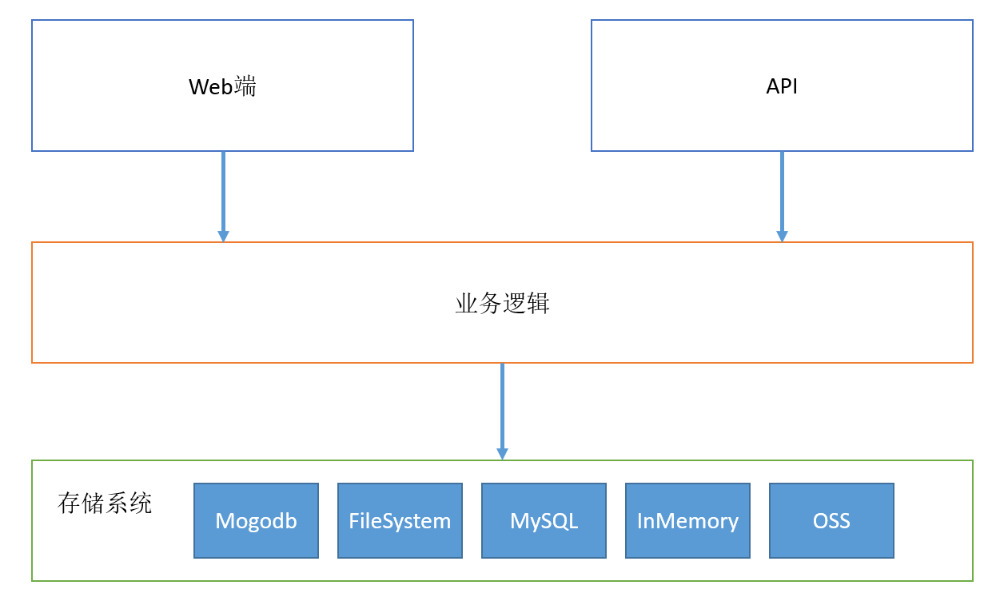

# 基于多存储平台的图片文件服务器

## 1. 目的

面向Web的应用程序离不开各种图片文件的展示，该项目致力于解决Web程序图片存储，展示问题。

## 2. 技术

+ Servlet
+ Freemarker模板引擎
+ Spring JDBC
+ MySQL数据库

## 3. 设计

+ MVC设计模式
+ 提供了API接口
+ 面向接口编程

## 4. 功能

### 4.1 Web可视化

+ 图片的上传
+ 图片的查询
+ 图片的删除
+ 图片的下载

### 4.2 API接口

在线文档：https://documenter.getpostman.com/view/4028454/RWTsqaZq

+ 图片的上传
+ 图片的查询
+ 图片的删除

## 5. 实现

#### 5.1 MySQL

基于MySQL存储的实现依赖MySQL服务器。能够同时将文件流和文件的元信息存储到MySQL数据库中。

#### 5.2 Memory

基于Memory存储的实现是为了快速看到项目的效果，全局维护一个Map结构，将所有的文件上传，下载，删除操作转换对Map的操作，数据都存储在内存中，仅作演示使用。

